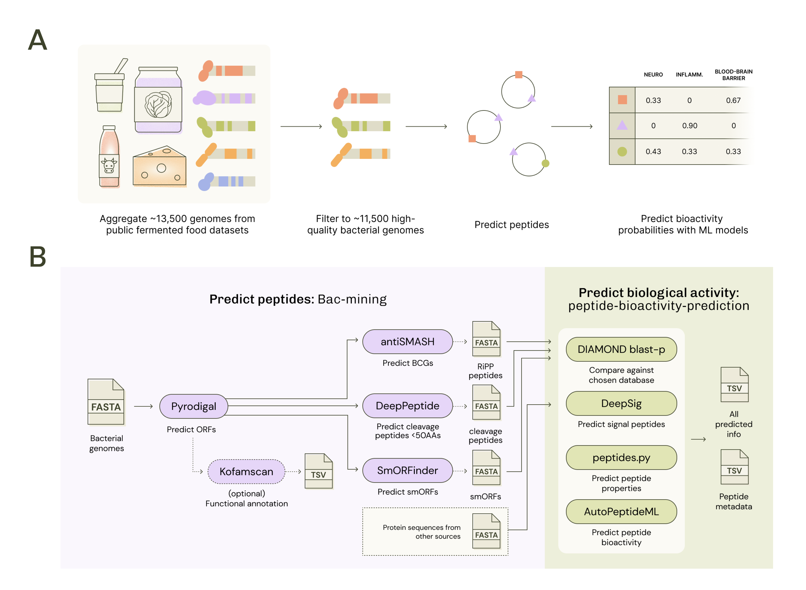

# Summarzing Mining and Bioactivity Results from Publicly Available Fermented Foods Genomes and Peptidomics Data

[](https://doi.org/10.5281/zenodo.18750850)

This repository contains scripts and notebooks for analyzing data produced by the [bac-mining workflow](https://github.com/MicrocosmFoods/bac-minining) and [peptide-bioactivity-prediction workflow ](https://github.com/MicrocosmFoods/peptide-bioactivity-prediction) for the following datasets: 

1.  5 Peptidomics Studies from Fermented Foods
2.  \~200 Bacterial Isolates from the BacDive database collected from various fermented foods
3.  \~11,500 bacterial metagenome-assembled genomes (MAGs) from diverse fermented food metagenomic surveys

The [fermentedfood_mags_curation](https://github.com/MicrocosmFoods/fermentedfood_mags_curation) repository documents how all of the MAG and BacDive isolate genome data were collected and processed.

## Repository Structure

This repository is setup so that all processed results from the workflows are in `results`, they are analyzed and viewed within the notebooks in the `notebooks` directory, which call functions from the `scripts/mag-mining-notebook-functions.R` script. The subdirectory structure is as follows: 

```
figures/ - Figures output from notebooks and figure generation scripts
metadata/ - Genome and proteomics sample metadata, most of the metadata is pulled from a controlled repository link with the most up-to-date genome metadata version
notebooks/ - Analysis notebooks
raw_data/ - Raw data for batches of bac-mining runs, BacDive genomes FASTA file, and raw FASTA files for the proteomics experiments
results/ - Results split up by dataset for outputs from the bac-mining and peptide-bioactivity-predictor workflows, as well as cleaned results
scripts/ - Scripts for notebook functions, figure generation, parsing and combining FASTA files for feeding into workflows for batch runs, and parsing raw files for the proteomics experiments
```

## Results

Raw files including FASTA sequences, machine learning models, and peptides results for all three data sources are [available on Zenodo](https://zenodo.org/records/16749254).

## Preprint
This work is published in the bioRxiv preprint [Leveraging publicly available datasets and machine learning approaches for predicting the health benefits of fermented foods](https://www.biorxiv.org/content/10.64898/2026.03.05.709865v1.full) where we use characterize the bioactive potential of fermented-food associated microbes and substrates through mining BGCs, peptides, proteomics datasets, and using machine learning classification models to predict the bioactivity of peptide sequences.



